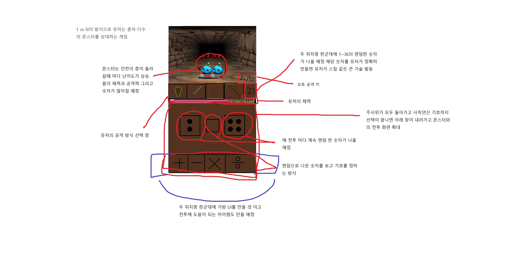

# 프로젝트명: 운도 실력이다

>[ 목차 ]
### 1. [컨셉](#컨셉)
### 2. [관련 이미지와 동영상](#관련-이미지--동영상)
### 3. [대표 이미지 그리고 컨셉과 대표이미지 기반 작품 묘사](#대표-이미지)
### 4. [구성 요소](#구성-요소)
   - [메커니즘](#1-메커니즘)
   - [이야기](#2-이야기)
   - [미적요소](#3-미적요소)
   - [기술](#4-기술)
### 5. [구성 요소 분석](#구성-요소-분석)
   - [게임 오브젝트 분해](#1-게임-오브젝트-분해)
   - [파라미터(속성) 뽑아 보기](#2-파라미터속성-뽑아-보기)
   - [행동 뽑아 보기](#3-행동-뽑아-보기)
   - [상태 뽑아 보기](#4-상태-뽑아-보기)
   - [플레이어 캐릭터 속성(파라미터)](#5-플레이어-캐릭터-속성파라미터)
   - [게임의 규칙](#6-게임의-규칙)

### 6. [스토리 보드](#스토리-보드)

# [컨셉]

## 메인컨셉 :

- 운
  - 설명: 제가 생각한 게임 특성상 주사위를 굴리는 것이 8~90%는 차지 할꺼라 보여 '운'이 중요한 서브 컨셉으로 생각 됩니다.

### 서브 컨셉 1 :

- 숫자 싸움
  - 설명: 전체적으로 봤을 때 숫자를 이용한 전투가 메인이 될꺼 기에 메인 컨셉을 숫자 싸움이라고 정했습니다

### 서브 컨셉 2 :

- 산술 능력
  - 설명: 아무리 능력이 좋아도 그때 그때 적절한 사칙연산 기호를 사용 할려면 기본적으로 '산술 능력'이 필요하다고 생각 됩니다.

### 서브 컨셉 3 :

- 육성
  - 설명: 운이 강력하게 적용되며 반복된 싸움을 하는데 있어 유저들은 지루함을 느끼기 마련이라고 생각합니다. 거기서 그나마 지루함과 승률을 올려주는데 '육성'이 필요하다고 생각 됩니다.

### 서브 컨셉 4 :

- 전투 임팩트
  - 설명: 단순히 숫자로만 높은 데미지를 넣어 주는 것 보다는 어느 정도의 임팩트가 있는 것이 더 쌔게 때렸다는 느낌을 주기에 있어 전투 임팩트 또한 중요하다고 생각 합니다.

### 서브 컨셉 5 :

- 도감
  - 설명: 다양한 몬스터와 거기서 나오는 다양한 전리품, 그리고 다양한 무기들을 얻을 때 마다 도감에 등록이 되며 그걸 채워간다는 또 다른 목적을 만들어 주기 위해서 입니다.

  

# [관련 이미지 & 동영상]

- 이미지  

 >### 전투 jpg
  
  

  출처 게임: '던전 앤 걸스: 카드 배틀 RPG'

 >### 로비 jpg

  
  
  출처 게임: '퀸즈 블레이드 리미트 브레이크'

 >### 육성 관련 jpg

  

  출처 게임: 'DUNGREED(던그리드)'

  

  출처 게임: 'Skul: The Hero Slayer(스컬 더 히어로)'

 >### 동영상

  

  

# [대표 이미지]

  

# [컨셉 & 대표이미지 기반 작품묘사]

> ### 대표이미지 기반 : 주사위를 돌려서 나온 숫자들의 합을 이용해 적들을 처치하는 방식
&nbsp;
> ### 컨셉 기반: 1/6 확률인 주사위 2개 이상을 돌려 나온 숫자 사이에 원하는 사칙연산을 써서 나온 숫자를 이용하여 적들을 처치함

  

# [구성 요소]
 

## 1. 메커니즘

[도전 과제]

1. 보스의 보물 창고 털고 살아서 나가기
2. 상대방 보다 높은 숫자로 공격 혹은 방어
3. 특수 숫자와 같은 숫자 맞추기
4. 던전을 돌며 다양한 무기 수집
5. 다양한 소모품을 이용한 유리한 전투

[재미 요소]

1. 상대보다 높은 숫자 만들기
2. 같은 종류의 무기여도 무기 마다 각기 다른 데미지
3. 활, 검, 방패 등으로 이루어진 상성 차이
4. 가끔 보이는 보물 획득과 가끔 만나는 행상인에게서 아이템 구매
5. 다양 아이템을 상점에 팔아 돈을 모으것

 

## 2. 이야기

[만들게 된 배경]  

여러 로그라이크 형식의 게임을 하다 보니 대부분의 게임 들이 운적이 요소가 들어가 있다는 걸 체감 하고 나서
'아 나는 그저 운으로만 이루어진 게임을 한번 만들어 봐야지'라는 생각으로 갖게 되고 이번을 기회로
실천해보기 위해 제작을 생각했습니다. 최종 목표는 플레이스토어에 판매!

[게임 속 기본 배경]

어느 날 갑자기 세계 곳곳에서 땅 속에서 던전이 솟아 올라 오게 되었고
해당 던전에서 돈이 될게 많을꺼라고 생각 하게 된 주인공이 그 던전을 깨러 들어가게 된다.

[카메라 관점]  

플레이어의 1인칭 시점으로 공격 임팩트와 적들만 보이게 할 생각입니다.

 

## 3. 미적요소

[맵 디자인 & 컬러]  

가장 흔한 던전이라는 느낌으로 대충 쌓은 돌로 이루어진 벽과 위로는 끝을 알 수 없는 어두움
앞은 횟불이 설치 되어 있어야 보이는 정도

[아이템 디자인]

중세 판타지 느낌의 다양한 무기들

[음향]  

아무것도 없어 보이는 동굴을 걷는 다는 느낌의 메아리 섞인 발소리, 
검을 휘두르는 소리와 활 시위를 당기는 소리, 방어에 성공 했을 때의 소리, 마법구 날라가는, 적이 맞는 소리
 

## 4. 기술

원터치 방식의 흔한 모바일 게임. Unity 엔진에 Aseprite를 이용한 도트 그림

# 구성 요소 분석

## 1. 게임 오브젝트 분해

|연번|오브젝트 이름|오브젝트 이미지|
|:----:|:----:|:----:|
|1|슬라임||
|2|고블린||
|3|스켈레톤||
|4|데몬||
|5|무기||
|6|주사위||
|7|숫자||
|8|방향키||
|9|더하기||

## 2. 파라미터(속성) 뽑아 보기

1. 몬스터들

|속성|영문명칭|설명|
|:----:|:----:|:----:|
|체력|Hp|몬스터들의 체력|
|턴|Turn|몬스터들의 공격까지 남은 시간|
|이름|Name|몬스터 명|
|장비|Equip|몬스터가 지금 착용 하고 있는 장비|

2. 행상인& 상점 주인

|속성|영문명칭|설명|
|:----:|:----:|:----:|
|가격|Price|아이템 가격|
|할인율|Sale|아이템들의 할인율|
|숫자|Dice_Number|할인에 사용될 행상인& 상점 주인의 주사위의 숫자(3)|

3. 무기들

|속성|영문명칭|설명|
|:----:|:----:|:----:|
|공격력|Weapon_Power|무기 기본 공격력|
|등급|Rank|무기의 등급|
|품질|Quailty|무기의 품질|

## 3. 행동 뽑아 보기

1. 플레이어

|행동|영문명칭|설명|
|:----:|:----:|:----:|
|공격|Player_Attack|원하는 무기를 이용하면 몬스터 공격|
|방어|Player_Defense|방패를 사용 하면 활을 든 공격 상대로 무조건 방어, 근접 공격은 50% 데미지 감소|
|이동|Player_Move|화면 아래 화살표를 눌러 해당 방으로 이동|

2. 몬스터들

|행동|영문명칭|설명|
|:----:|:----:|:----:|
|공격|Monster_Attack|몬스터의 턴이 끝나면 플레이어를 공격|
|방어|Monster_Defense|몬스터가 방패를 들고 있으면 플레이어의 활 공격을 무조건 방어, 근접 공격은 50% 데미지 감소|
|이동|Monster_Move|플레이어의 공격이 끝나면 공격까지 남은 턴이 1턴씩 감소|

## 4. 상태 뽑아 보기

1. 플레이어

|현 상태|전이 상태|전이 조건|
|:----:|:----:|:----:|
|정지|공격|원하는 무기를 선택 후 타겟 선택|
|정지|방어|공격을 당하기 전에 방패 선택|
|정지|이동|화면 아래 화살표를 눌러 이동 (미니맵 상에서만 이동 확인 가능)|

2. 몬스터들

|현 상태|전이 상태|전이 조건|
|:----:|:----:|:----:|
|정지|공격|턴이 모두 끝나면 플레이어를 들고 있는 무기로 공격|
|정지|방어|몬스터가 방패를 들고 있을 때 플레이어가 활로 공격시 무조건 방어, 근접 공격은 50% 데미지 감소|
|정지|이동|플레이어의 턴이 끝나면 1턴씩 감소|

## 5. 플레이어 캐릭터 속성(파라미터)

|속성|영문 명칭|설명|
|:----:|:----:|:----:|
|체력|Hp|턴이 모두 끝나면 플레이어를 들고 있는 무기로 공격|
|장비|Sheild, Sword, Bow, Wand|플레이어가 선택 가능한 무기들|
|상태 이상|Debuff|출혈, 회복 불가, 독, 환영 등을 알려줄 상태 이상 표시|
|특수 숫자|Special_Number|특수 공격을 가능하게 해줄 특수한 숫자|
|가방|Bag|소모품들을 들고 다닌수 있게 해주는 가방|
|공격력|Player_Power|플레이어의 기본 공격력(로비에서 강화 가능)|

## 6. 게임의 규칙

1) 핵심 규칙
   -승리 규칙
      던전을 탐색 하다가 만나는 몬스터를 주사위 2개를 굴려서 나온 숫자에 사칙연산을 대입해 나온 숫자로 추가 공격력을 얻어서 나오는 몬스터들을 모두 죽이면서 최종 20층까지 도달하기
      20층에선 죽지 않고 최대한 많은 양의 보물 훔쳐 오기

   -패배 규칙
      플레이어의 체력이 0이 됐을 경우 마을로 돌아와짐 (획득한 골드의 일부를 소모 대략 10~60%)

2) 보조 규칙
   -그외 규칙들
      죽지 않기 위해 적당한 층에서 걸어서 탈출 가능(일부 금액을 내면 바로 탈출)
      마을에서 캐릭터 육성 및 무기 강화
      몬스터들은 플레이어의 공격이 끝난 후에 1턴씩 소모(플레이어의 선 공격)
      플레이어가 근접 공격시 남은 몬스터들의 턴은 모두 1로 변경
      
      
## 7. 게임에서 사용될 공식

1. 플레이어의 최대 체력은 100
2. 플레이어의 기본 공격력은 10
3. 주사위 숫자 1당 추가 기본 공격력 +1
4. 플레이어의 주사위 숫자의 결과 값이 몬스터의 주사위 수 보다 클 경우 그 차이 만큼의 추가 공격력 획득
5. 플레이어의 주사위 숫자의 결과 값이 몬스터의 주사위 수 보다 작을 경우 그 차이 만큼의 공격력 저하
6. 방패 사용시 상대방의 활 공격은 무조건 방어, 근접 공격은 50%의 데미지 감소, 마법 공격은 데미지 감소 없이 무조건 피해
7. 플레이어가 사망 할 경우 해당 던전에서 얻은 골드는 주사위를 돌려 10~60% 감소 하고 마을로 복귀

# 스토리 보드

|스토리 보드 4컷 만화||
|:----:|:----:|
|||
|어느날 갑자기 알수 없는 탑이 올라오더니 지상에 자리를 잡았다.|그리고 우리의 주인공은 생계를 유지 할 돈이 부족하게 되어 돈을 벌 곳을 찾고 있었는데|
|||
|어느날 길을 걷가가 마을의 한 광고판을 보고선 돈을 벌 방법을 찾게 되었다|그것은 던전을 내부에 있는 전리품들의 가격이 비싸다는 것이다. 그리고 주인공은 돈을 벌기 위해 던전을 가게 되었다.|
